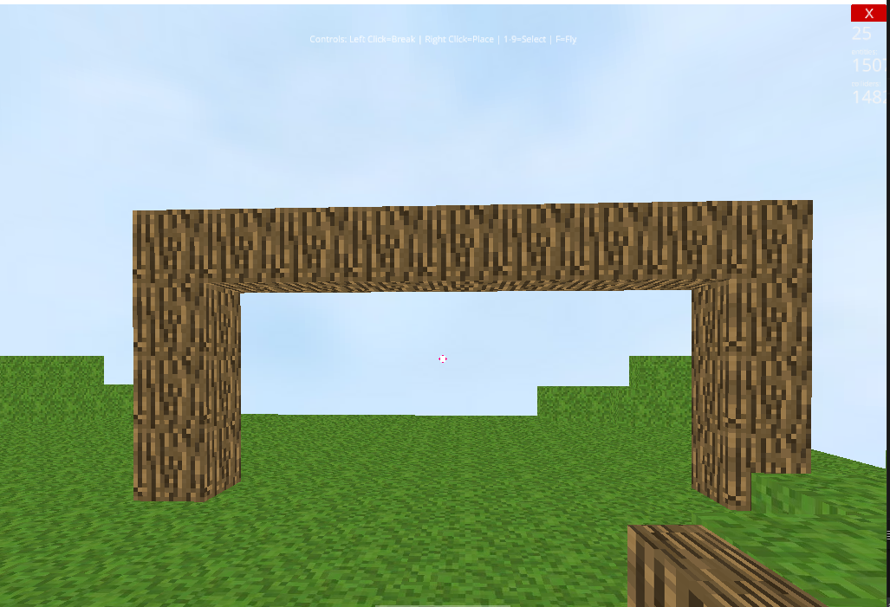
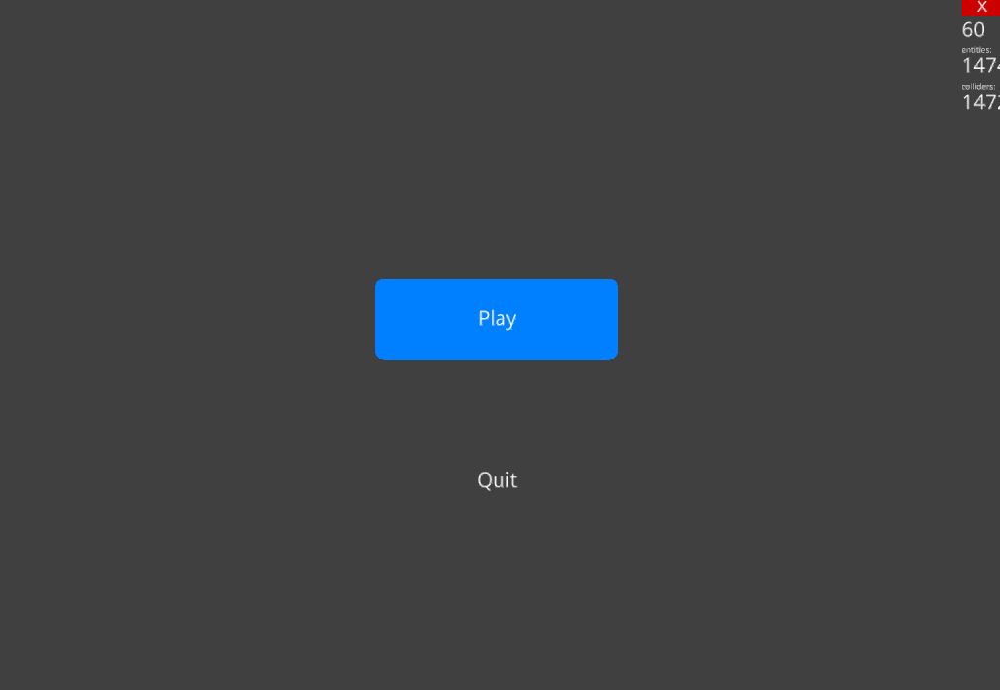

# 🧱 Minecraft Alpha Clone 

A simple yet engaging Minecraft-style 3D sandbox game built using Python and the [Ursina Engine](https://www.ursinaengine.org/). In this alpha version, you can explore a procedurally generated voxel terrain, place and destroy blocks, switch block types, and enjoy smooth first-person controls — all from an intuitive UI and HUD.


## 🎮 Features

- 🗺️ **Procedural Voxel Terrain**: Dynamically generated terrain using a simple heightmap.
- 👷 **Block Placement & Destruction**: Build and destroy in a fully interactive environment.
- 🧱 **Multiple Block Types**: Grass, dirt, stone, bricks, planks, and more.
- 🧰 **Hotbar Inventory**: Quick switch between 9 different block types.
- 👁️ **First-Person Controller**: Smooth camera and player movement using `FirstPersonController`.
- 🖐️ **Player Hand Animation**: Dynamic texture updates based on selected block.
- 🌄 **Skybox & Lighting**: Immersive sky and directional lighting to simulate daylight.
- ⏸️ **Main Menu**: Basic menu system with Play and Quit buttons.
- 🧭 **Heads-Up Display (HUD)**: Crosshair, block counter, inventory UI, and control hints.

## ⌨️ Controls Summary

| Action             | Key / Input         |
|--------------------|---------------------|
| Break Block        | Left Mouse Button   |
| Place Block        | Right Mouse Button  |
| Select Block       | Number Keys 1–9     |
| Toggle Fly Mode    | F                   |
| Move Around        | WASD                |
| Jump               | Space               |
| Exit Game          | ESC                 |

---

## 📂 Project Structure

```
project_root/
│
├── main.py               # Main game script (this file)
├── asset/                # Texture assets
│   ├── grass.png
│   ├── dirt.png
│   ├── stone.png
│   ├── ...
│   └── sky.png
```

Make sure the `asset` folder exists and includes the necessary block textures in `.png` format.

---

## ▶️ Getting Started

### 🔧 Requirements

- Python 3.7+
- [Ursina Engine](https://pypi.org/project/ursina/)

### 📦 Installation

```bash
pip install ursina
```

### 🚀 Run the Game

```bash
python main.py
```

---

## 🖼️ Screenshots

> Add your gameplay screenshots here by uploading them and linking like below:





```

---

## 💡 Ideas for Future Improvements

- Add sound effects and music
- Implement block stacking limits
- Day-night cycle
- Save/load world functionality
- Crafting system

---

## 🤝 Contributing

Pull requests and feedback are welcome! Feel free to fork the repo and improve the gameplay, visuals, or performance.

---

## 🧑‍💻 Author

**Faaiz Ahmed**  
[GitHub Profile](https://github.com/faaiz-ahmed)


## License 📜
This project is open source and available under the [MIT](https://choosealicense.com/licenses/mit/)

